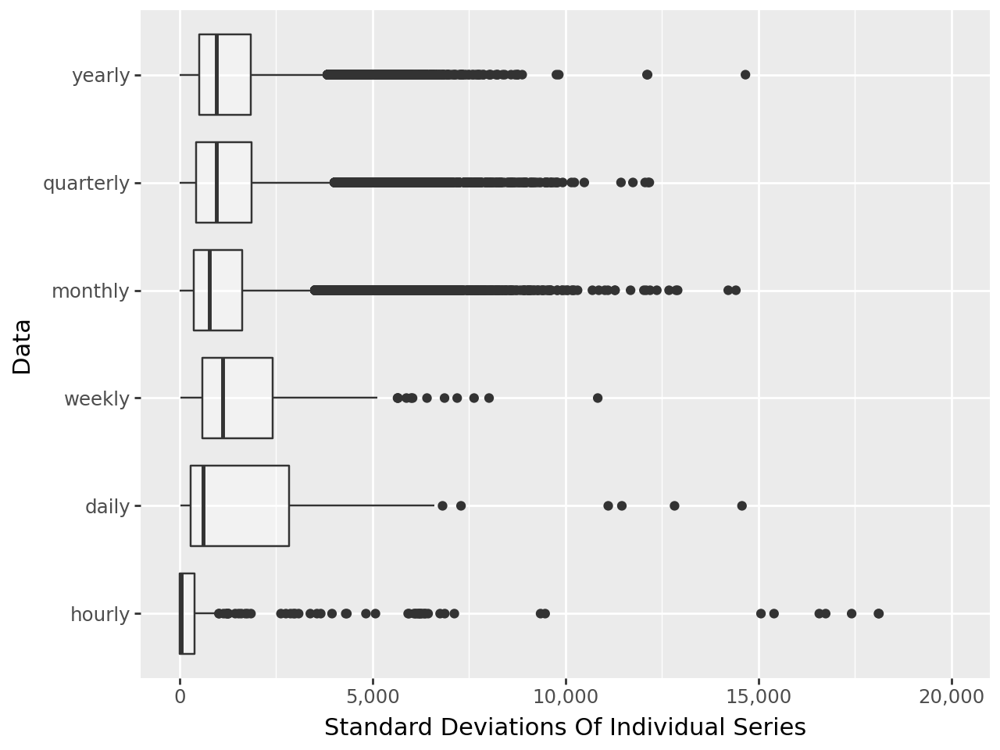

# Summary

This repo takes the
[M4](https://www.sciencedirect.com/science/article/pii/S0169207019301128)
competition’s data and builds 7 different models:

- 7th: Neural Basis Expansion Analysis with Exogenous (NBEATSx)
- 10th: Neural Hierarchical Interpolation for Time Series (NHITS)
- 34th: Temporal Fusion Transformer (TFT)
- 34th: Ridge Regression
- 34th: Boosting
- 37th: Seasonal Naive
- 41st: Last Value Naive

My best model beat the 7th place submission. My second best model beat
the 10th place submission.

# Data Overview

Beginning in 1982, Spyros Makridakis (the M in M4) ran time series
competions that define the state of the art in time series modeling.

- M1: 111 time series in 1982
- M2: 29 series in 1993
- M3: 300,3 in 2000
- M4: 100,000 in 2020
- M5: 42,840 in 2021
- M6: 50 series in 2022

This repo focuses on the M4 competition as it includes the most series
and poses the highest computational challenge. The 100,000 time series
are broken up between hourly, daily, weekly, monthly, quarterly, and
yearly datasets. Within each dataset, series come from different domains
including economics, finance, demographics, and finance.

Data:

- Spyros Makridaki’s
  [website](https://forecasters.org/resources/time-series-data/)
- [Github](https://github.com/Mcompetitions)

### Cleaning Process

Pulling the raw data from the competition page lead to some challenging
data shaping issues. First, series Y13190 contained 835 years worth of
data meaning data collection started in year 1,182 at the latest.
Second, series Y3820 ends in the future. I am not the only person to
notice
[this](https://openforecast.org/2020/03/01/m-competitions-from-m4-to-m5-reservations-and-expectations/).
I was unable to find clear documentation how participates handeled these
series. It is possible they simple accepted these series as is.

Due to these challenges, I avoid cleaning the data myself. Instead, I
leverage nixtla’s dataset
[package](https://nixtlaverse.nixtla.io/datasetsforecast/index.html)
which includes a cleaned version of data. The only check I do is to
confirm each dataset has the correct number of series.

- Step 1: Download data.
- Step 2: Count number of series.
- Step 3: Write data.

### Data Exploration

Longer frequency data (i.e. yearly) tend to be shorter series than short
frequency series (i.e. daily). Within each dataset, the length of the
series is inconsistent.

There is large variability in average value of series in most datasets.

Within each dataset, there is large variability in standard deviations
of series.

# Ecosystem Overview

The Nixtla ecosystem defines a standardized data shape and provides well
over 50 different models with a unified interface. This makes changing
between time series models as easy as changing between regression models
with sci-kit learn. Cross validation and a wide variety of metrics are
provided as well.

### Neural Forecast

Neural forecast is a collection of 18 different deep learning models
specifically focused on time series analysis. They span many categories
including recurrent neural networks, multi layer perceptrons,
transformers, and convolutional neural networks. All models are
implemented with pytorch lightning meaning all models can run on a CPU,
a GPU, or multiple GPUs.

### ML Forecast

ML forecast does not provide new models directly. Instead it provides
functions to take the standadrized time series data and shape into
tabular data. From there, standard machine learning models are used.
These models can come from sci-kit learn, xgboost, or any other library
that follows a sci-kit learn interface.

# Model Summary

### Comparison with Other Participates

The first vertical line is 1st place. The second vertical line is 7th
place. Out of 61 submissions, my best model beat the 7th place model in
the M4 competition.

### Naive Models

I was able to reproduce the smape for both the last value naive model
and the seasonal naive model.

### ML Models

Ridge regression and boosting with lightgbm are the machine learning
models used here. Their parameters were tuned using a time based cross
validation. 50 different combinations of hyper parameters were done.
Interestingly, boosting did no better than ridge regression. Roughly,
training a single boosted model takes longer than training 50 ridge
regression models.

### Deep Learning Models

All deep learning models are tuned on 50 iterations of cross validation
each. Overall, deep learning is superior to machine learning based
approaches for these data. NBeats and NHits beat boosting and ridge
regression by a wide margin. The TFT model matches performance.

# Code Overview

Run order:

- prep_data
- train models (train_baseline_models, train_deep_lerning_models,
  train_ml_models)
- summarize_results

train_stats_models was not used because code took too long to run.

Two conda environments were used. Most code runs on nixtlaEnv. The
nixtlaEnvDeep environment was created to get GPU support for deep
learning models. Conda commands and environment files are included.
